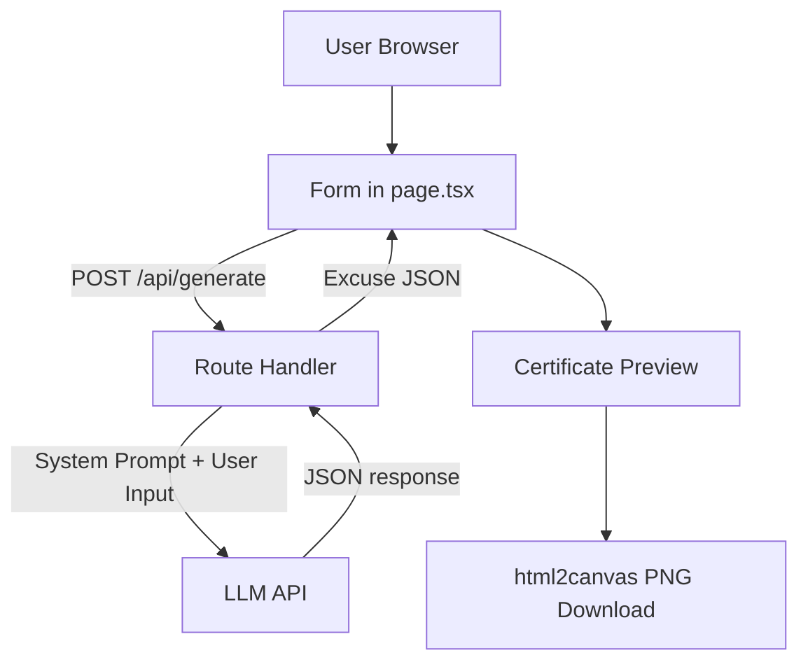

# アーキテクチャ設計

## 構成
- Frontend: Next.js App Router
- API: Next.js Route Handler (`/api/generate`)
- LLM: 外部API（GLM-4.7-flash予定）
- Export: html2canvas

## システム設計図


## 主なデータ契約
```ts
interface ExcuseData {
  title: string;
  reference_number: string;
  subject: string;
  content: string;
  rank: string;
}
```

## エラー経路
- 400: 入力不足
- 500: APIキー未設定 / 予期せぬ例外
- 502: LLM通信失敗 / JSON不正
